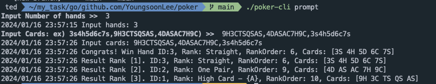
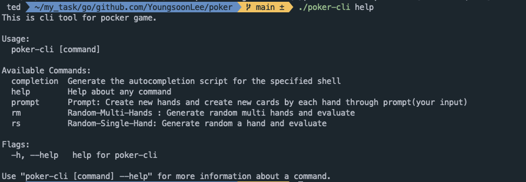
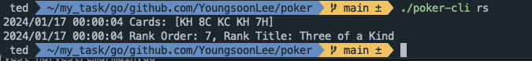
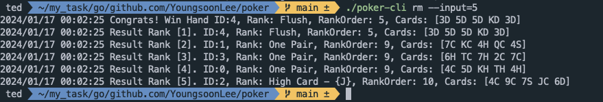

## Overview
Implement a poker hand evaluator.

## Requirements:
#### 1. Poker Hand Evaluator:
Implement a function that takes a list of five cards (represented as strings) and
determines the best poker hand the cards can form (e.g., Straight Flush, Four of a Kind, Full House, etc.).
You must output the rank of the hand as a number which can be compared against any other hand. Equal hands must output the same number rank.
You do not need to consider the more complicated cases of 2-4 cards or 6+ cards but may develop the algorithm for those cases if you would like.
#### 2. Card Representation:
Externally represent each card using two characters: one for the rank (2-9, T, J,Q, K, A) and one for the suit (S, H, D, C). You are not required to use this representation internally, you just need to be able to map between the internal representation you choose and this external representation. 


## How to develop
#### 1.My algorithm is as follows
    1. Take an input of how many hands there are.
    2. Take inputs card string.
    3. Validate the entered card string.
    4. Evaluate
        - Using Sort ( O(logN) )
        - Get evaluate rank(string) and rank order(int)
    5. Rank who won.
        - Using MinHeap by evaluated rank order ( O(logN) )
    6. Print who won and Print whole detail information like handID, rank(string), rank order(int) and cards(string)

ex)



#### 2. I made it a CLI tool. How to use it is below.


    
## How to Run (usage)
### Run
```console
> git clone https://github.com/YoungsoonLee/poker.git
> cd poker
> ./poker-cli prompt
```


### CLI Command
```console
./poker-cli help : you can see help include command
```


```console
./poker-cli rs : Random-Single: Generate random cards for a hand and then evaluate and then show the result.
```


```console
./poker-cli rm --input=5 : Random-Multi-Hands: Generate random cards for multi hand(--input) and then evaluate and then show the result.
```


```console
./poker-cli promt : Take the number of hands and cards as input. and then evaluate and then show the result.
```


### Build
```console
make build
```

## Rank Order
I referenced this site for [rank order](https://www.cardplayer.com/rules-of-poker/hand-rankings)

| Ran Order (int)   | Rank (string)         |
| ------------------| ----------------------|
|       1           |  Royal flush.         |
|       2           |  Straight flush.      |
|       3           |  Four of a kind.      |
|       4           |  Full house.          |
|       5           |  Flush                |
|       6           |  Straight             |
|       7           |  Three of a kind.     |
|       8           |  Two pair.            |
|       9           |  Pair                 |
|       10          |  High Card.           |


## Version & Library
-   Golang : v1.21
-   I used the standard library, but for fast and convenient CLI development I used Cobra and the promptui library.
-   For CLI:
    -   [cobra](https://github.com/spf13/cobra)
    -   [promptui](https://github.com/manifoldco/promptui)

